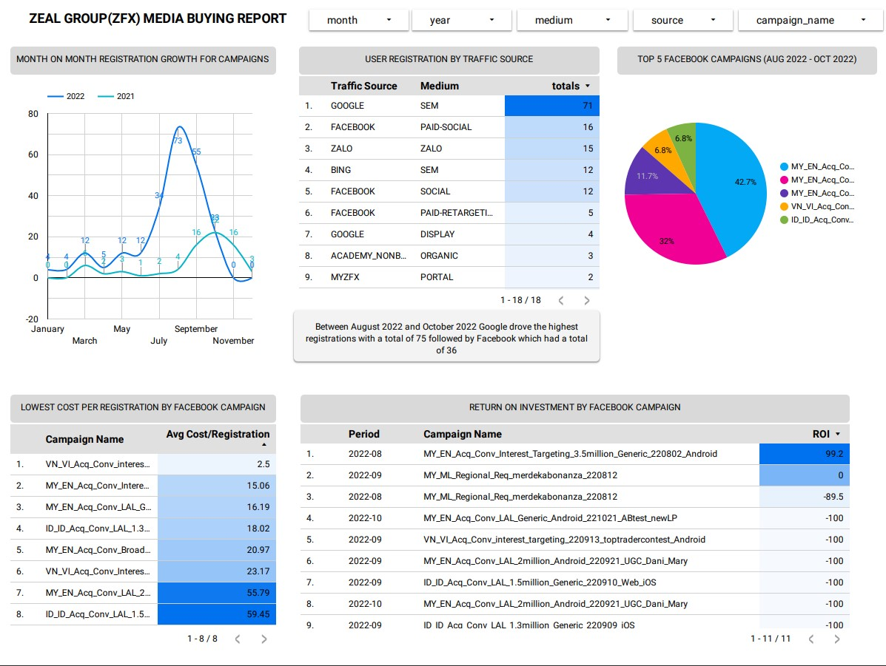
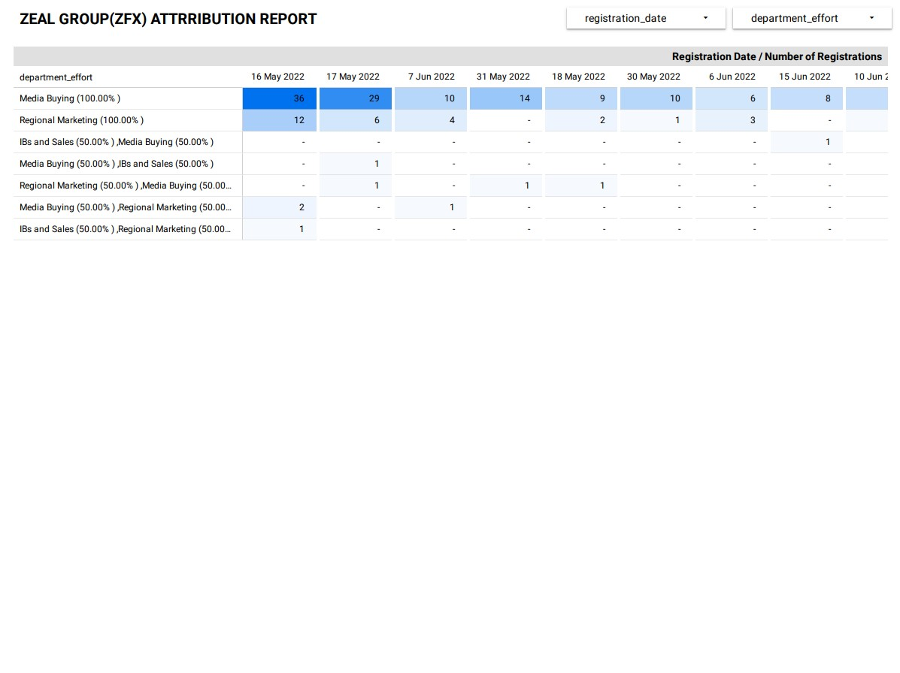

# Social-Media-Campaign-Analytics-Report

Data Studio/Big Query Social Madia Campaign Analytics Report

I developed a Data Studio report that leveraged SQL queries in analysing a Big Query dataset for a stakeholder. The stakeholder's objective was to monitor the number of registrations and growth percentage associated with Facebook and Google campaigns and make a comparison between their performance in 2021 and 2022. Business areas/questions to be addressed for the media buying team included:

1.Month on month registration growth for Facebook & Google Campaigns per year.
2.The traffic source that drove max registrations from August 2022 to October 2022.
3.Top 5 Facebook Campaigns that drove the highest number of registrations from August 2022 to October 2022.
4.Facebook Campaigns that drove the lowest cost per registration from August 2022 to October 2022.
5.Showing the campaigns that drove the highest ROI % (Cost VS Net Deposit).

[CLICK HERE TO VIEW THE SQL SCRIPTS USED](https://github.com/dchishakwe/Social-Media-Campaign-Analytics-Report/tree/main/SQL%20Queries)

